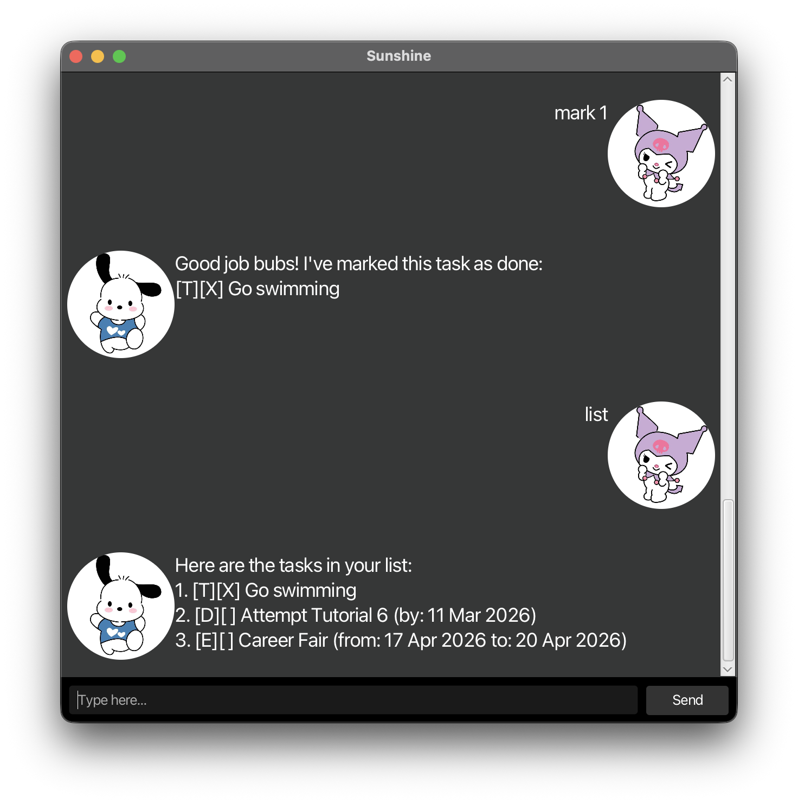

# Sunshine User Guide



## Sunshine

> "Your mind is for having ideas, not holding them." – David Allen ([source](https://dansilvestre.com/productivity-quotes/))

Sunshine frees your mind of having to remember things you need to do. It's,

- text-based
- easy to learn
- ~FAST~ _SUPER FAST_ to use

All you need to do is,

1. download it from [here](https://github.com/NUS-CS2103-AY2526-S2/ip/pull/167).
2. double-click it.
3. add your tasks.
4. let it manage your tasks for you 😉

And it is __FREE__!

Features:
- [x] Managing tasks
- [x] Managing deadlines
- [ ] Reminders (coming soon)

## Communicating with Sunshine

Upon starting Sunshine, your locally saved tasks (if any) will be loaded into memory.

Talk and give instructions to Sunshine by typing them in the textbox at the bottom of the GUI,
and hit enter or click the send button to confirm.

Below are some of the commands Sunshine supports.

## Adding to-do tasks

Start by adding a simple task with just a description to your list.

Example: `todo Go swimming`

Sunshine replies with the following confirmation.
[T] indicates this is a To Do task. [ ] indicates it has yet to be completed _(see marking/unmarking tasks below)_.

```
Got it. I've added this task:
[T][ ] Go swimming
Now you have 1 task(s) in the list.
```

## Adding tasks with deadlines

Some tasks you want to add may have to be finished by a certain time.

Example: `deadline Attempt Tutorial 6 /by 11/03/2026` _(Sunshine recognises dates in the format dd/mm/yyyy!)_

Sunshine replies with the following confirmation.
[D] indicates this is a Deadline task.

```
Got it. I've added this task:
[D][ ] Attempt Tutorial 6 (by: 11 Mar 2026)
Now you have 2 task(s) in the list.
```

## Adding events

Sunshine can help you keep track of events too.

Example: `event Career Fair /from Thursday 3pm /to 6pm`

Sunshine replies with the following confirmation.
[E] indicates this is an Event.

```
Got it. I've added this task:
[E][ ] Career Fair (from: Thursday 3pm to: 6pm)
Now you have 3 task(s) in the list.
```

## Listing tasks

To see all that you've added to your list thus far, simply request Sunshine to
`list`.

```
Here are the tasks in your list:
1. [T][ ] Go swimming
2. [D][ ] Attempt Tutorial 6 (by: 11 Mar 2026)
3. [E][ ] Career Fair (from: Thursday 3pm to: 6pm)
```

## Marking/Unmarking tasks

Once you've completed a task or finished an event, mark it as completed.
Made a mistake? Go ahead and unmark it.

Example: `mark 1` _(Tasks are 1-indexed, as listed by `list`)_

```
Good job, bubs! I've marked this task as done:
[T][X] Go swimming
```

Example: `unmark 1` 

```
So you lied to me la. I've marked this task as not done yet:
[T][X] Go swimming
```

## Deleting tasks

To keep a clear working list, you may delete tasks that are no longer relevant,
whether they are marked as completed or not.

Example: `delete 2` 

```
You bum. I've removed this task:
[D][ ] Attempt Tutorial 6 (by: 11 Mar 2026)
You now have 2 task(s) in the list.
```

## Searching for tasks

If you have a lot of tasks on-hand, you may find it helpful to search for ones containing a particular keyword.

Example: `find Career Fair`

```
Here's what I found, bubs:
1. [E][ ] Career Fair (from: Thursday 3pm to: 6pm)
```

## Getting help on commands

For a quick refresher on all the commands and their uses, just ask Sunshine for `help`!

```
You everything also don't know one.

Here's a list of commands you can use:

...
```

## Closing Sunshine

Once you're all done updating and tracking your tasks for the time being, say farewell to Sunshine with a quick `bye`.

Sunshine says farewell back, and closes the GUI for you.

```
Goodnight, rest well and sweet dreams.
Hope to see you again soon!
```

All tasks are saved locally, ready to be loaded the next time you boot Sunshine up!

